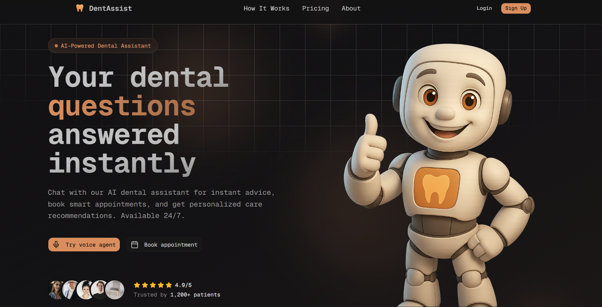
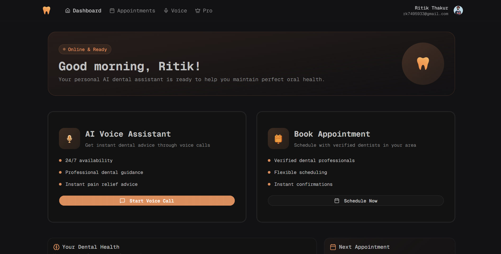
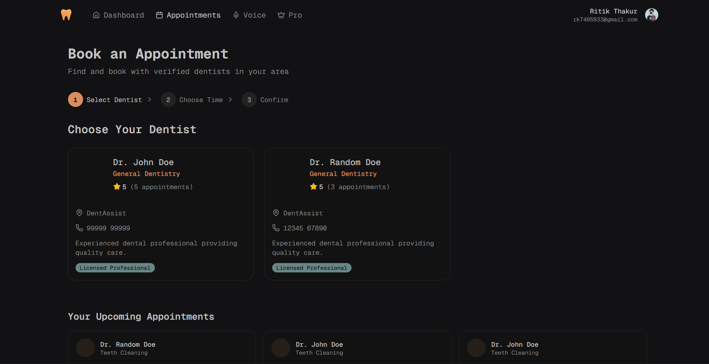
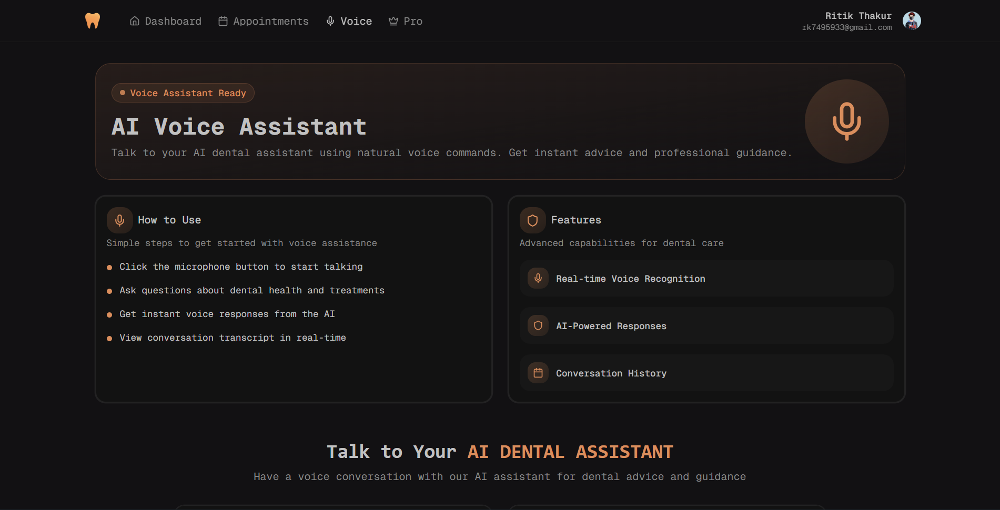
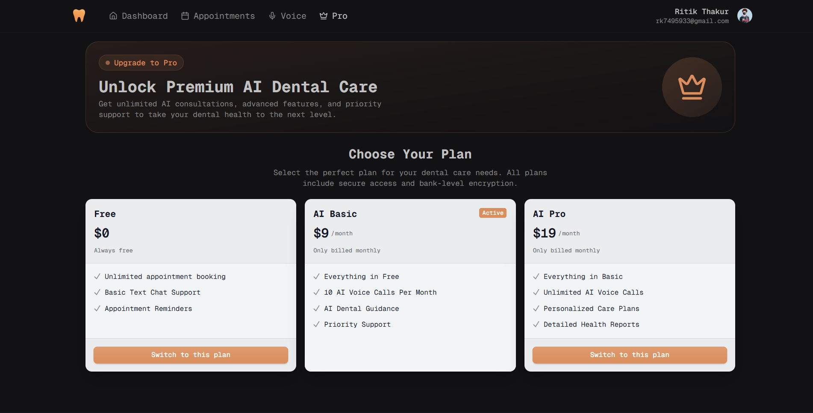
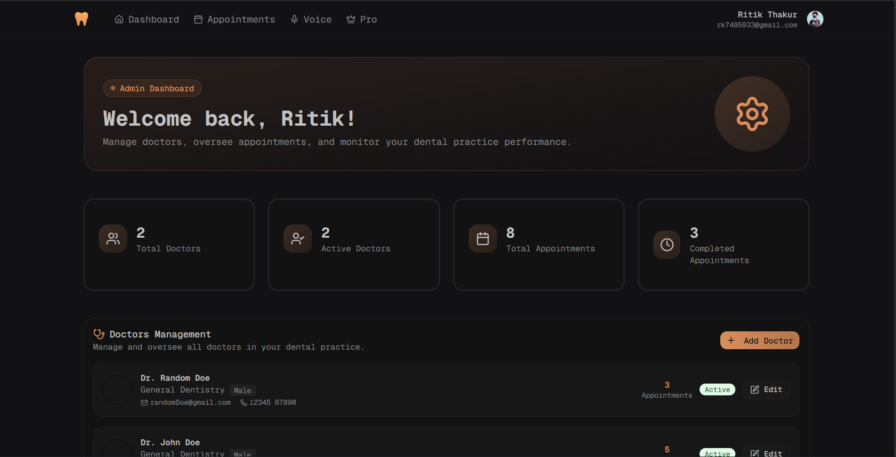

# 🦷 DentAssist AI

### *Your AI-powered dental assistant for smarter healthcare*

<p align="center">
  
  
  
  
</p>

<p align="center">
  
  
  
  
  
  
  
</p>

---

<p align="center">
  
</p>

<p align="center">
  🚀 AI Voice Assistant • 📅 Smart Appointments • 🧠 Personalized Care
</p>

<p align="center">
  <a href="https://dent-assist-ai-three.vercel.app"><strong>🌐 Live Demo</strong></a> •
  <a href="https://github.com/Ritik-Thakur-sudo/DentAssist-AI"><strong>💻 GitHub</strong></a> •
  <a href="https://personal-portfolio-sigma-two-57.vercel.app/"><strong>👨‍💻 Portfolio</strong></a>
</p>

---

## ✨ Overview

DentAssist AI is a **modern AI-powered dental assistant platform** that enables users to:

* 🧠 Get instant dental advice using AI
* 🎙️ Talk with a real-time voice assistant
* 📅 Book appointments with dentists *(mock/demo data for simulation)*
* 📊 Manage dental health & history
* 💳 Upgrade to premium AI features

---

## 🎯 Why This Project?

This project demonstrates:

* Building a full-stack SaaS application
* Integrating AI features (voice + responses)
* Handling authentication and secure data
* Designing scalable architecture
* Deploying production-ready applications

---

## ⚡ Features

* 🧠 AI-powered dental assistant
* 🎙️ Real-time voice interaction
* 📅 Smart appointment booking
* 📊 Personalized dashboard
* 💳 Subscription plans (Free / Basic / Pro)
* 🔐 Secure authentication with Clerk

---

## ⚠️ Note

This project currently uses **demo/mock dentist data** for demonstration purposes.
The system is fully designed to support real-world integration with verified dental professionals.

---

## 📸 Preview

### 🏠 Landing & Dashboard

<p align="center">
  
  
</p>

### 📅 Appointments & Voice AI

<p align="center">
  
  
</p>

### 💰 Pricing & Admin Panel

<p align="center">
  
  
</p>

---

## 🧱 Tech Stack

### 🚀 Frontend

* **Next.js 16**
* **React 19**
* **Tailwind CSS 4**

### ⚙️ Backend

* **Node.js**
* **Next.js API Routes**

### 🗄️ Database

* **PostgreSQL (Neon)**
* **Prisma ORM**

### 🔐 Authentication

* **Clerk**

### ☁️ Deployment

* **Vercel**

---

## 📁 Project Structure

```bash
dentassist-ai/
│── prisma/               # Database schema
│── public/               # Static assets & screenshots
│── src/
│   ├── app/              # App router (pages)
│   ├── components/       # UI components
│   ├── hooks/            # Custom hooks
│   ├── lib/              # Utilities (Prisma, APIs)
│   ├── actions/          # Server actions
│── .env
│── package.json
│── README.md
```

---

## ⚙️ Getting Started

```bash
git clone https://github.com/Ritik-Thakur-sudo/DentAssist-AI.git
cd DentAssist-AI
npm install
npm run dev
```

---

## 🔑 Environment Variables

Create a `.env` file in the root directory and add the following:

```env
# 🗄️ Database (PostgreSQL - Neon)
DATABASE_URL=your_database_url

# 🌐 App URL
NEXT_PUBLIC_APP_URL=http://localhost:3000

# 🔐 Authentication (Clerk)
NEXT_PUBLIC_CLERK_PUBLISHABLE_KEY=your_publishable_key
CLERK_SECRET_KEY=your_secret_key

# 📧 Email Service (Resend)
RESEND_API_KEY=your_api_key

# 🎙️ AI Voice Assistant (VAPI)
NEXT_PUBLIC_VAPI_ASSISTANT_ID=your_assistant_id
NEXT_PUBLIC_VAPI_API_KEY=your_api_key
```

### 🔧 Setup Tips

* Use **Neon** for PostgreSQL
* Use **Clerk** for authentication
* Use **Resend** for email delivery
* Use **VAPI** for AI voice assistant

> ⚠️ Some environment variables are simplified or anonymized for security reasons.

---

## 🚀 Deployment

Deploy easily using **Vercel**:

1. Push code to GitHub
2. Import project in Vercel
3. Add environment variables
4. Deploy 🚀

---

## 📈 Future Improvements

* 🔗 Webhooks for real-time event handling
* 🚦 Rate limiting & API abuse protection
* ⚙️ Background job queue (async tasks)
* 📈 Advanced analytics dashboard
* 🔔 Real-time notifications
* 🧪 Unit & integration testing
* 🔐 Enhanced security layers
* 🤖 Improved AI responses

---

## 🤝 Contributing

Pull requests are welcome!

---

## 📬 Contact

👤 Ritik Thakur
📧 [rk7495933@gmail.com](mailto:rk7495933@gmail.com)

---

## ⭐ Support

If you like this project:

👉 Give it a ⭐ on GitHub
👉 Share it with others
